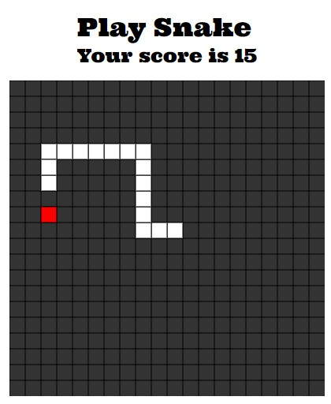

# Build a clsssic SNAKE game with P5js

Ref:

[P5js Documentation](https://p5js.org/)

[Repository](https://github.com/pratikkute/snake-p5js)

## Final result



## P5.js


p5.js is a JavaScript library for creative coding, with a focus on making coding accessible and inclusive for artists, designers, educators, beginners, and anyone else! p5.js is free and open-source because we believe software, and the tools to learn it, should be accessible to everyone.

### Getting started with P5js

Add cdn path for p5.js in your head of index file

```html
<script
  src="https://cdnjs.cloudflare.com/ajax/libs/p5.js/1.4.0/p5.min.js"
  integrity="sha512-N4kV7GkNv7QR7RX9YF/olywyIgIwNvfEe2nZtfyj73HdjCUkAfOBDbcuJ/cTaN04JKRnw1YG1wnUyNKMsNgg3g=="
  crossorigin="anonymous"
  referrerpolicy="no-referrer"
></script>
```

Create div to for canavs

```html
<div id="canvasDiv"></div>
```

Create a sketch.js file add it in index file

```html
<script src="sketch.js"></script>
```

Now do the basic setup for your canvas for p5.js

```js

function setup() {
  var myCanvas = createCanvas(winWidth, winHeight);
  myCanvas.parent("canvasDiv");
}
function draw() {
  background(51);
}
```

## Now you are ready to swrite your game login

Check the repo for final code [Repository](https://github.com/pratikkute/snake-p5js)